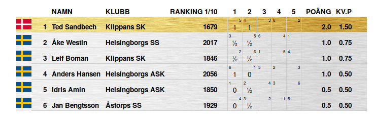

# 2022-008-Berger

Den variant av Berger system som är vanligt förekommande kan förbättras.
Se *Berger Spelare*

Max 52 spelare, pga alfabetet

Jämnt halvbord: Vit

Udda halvbord: Svart

Visar Berger på fem olika sätt:

1. Round-Robin: Spelarna roterar runt ett bord. Högsta spelaren alternerar mellan lägsta och högsta halvbordet. (Samma bord)
1. Cirkeln: Egentligen samma som Round-Robin
1. Rotation: Cirkeln roterad. Byt rond
1. "Normal" Berger med spelare
1. Berger med halvbord istf spelare
